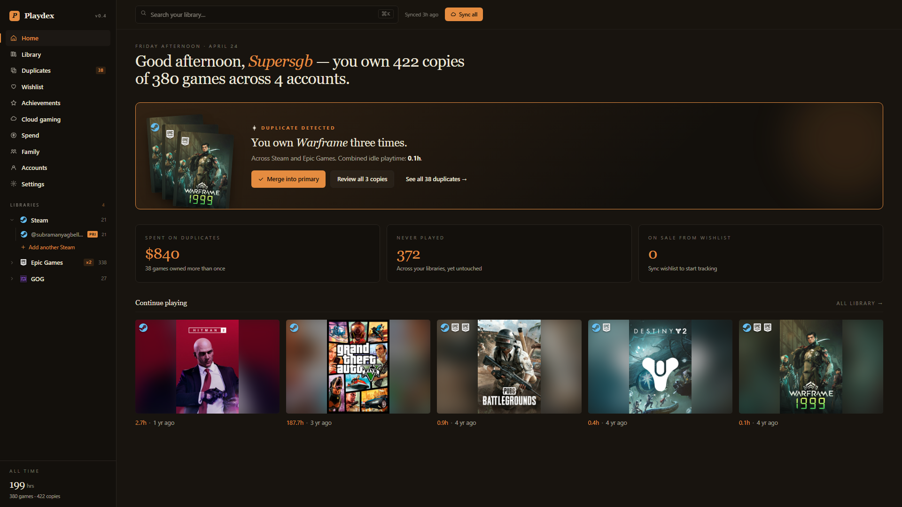
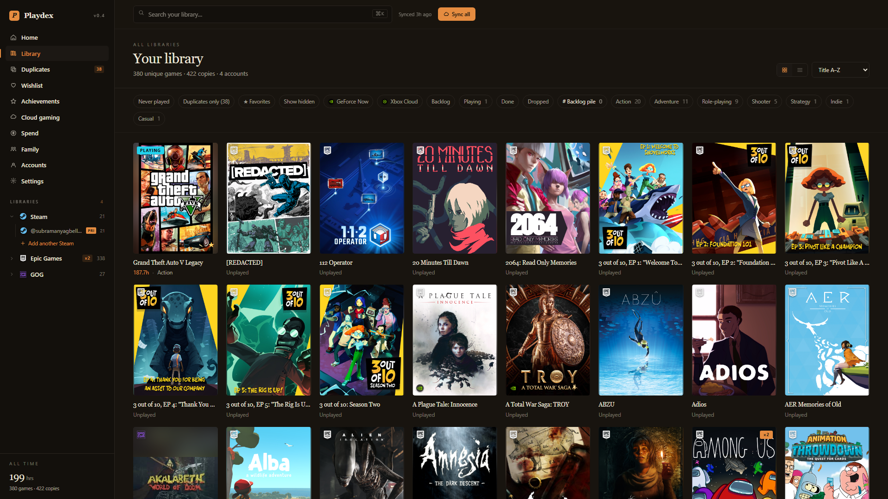
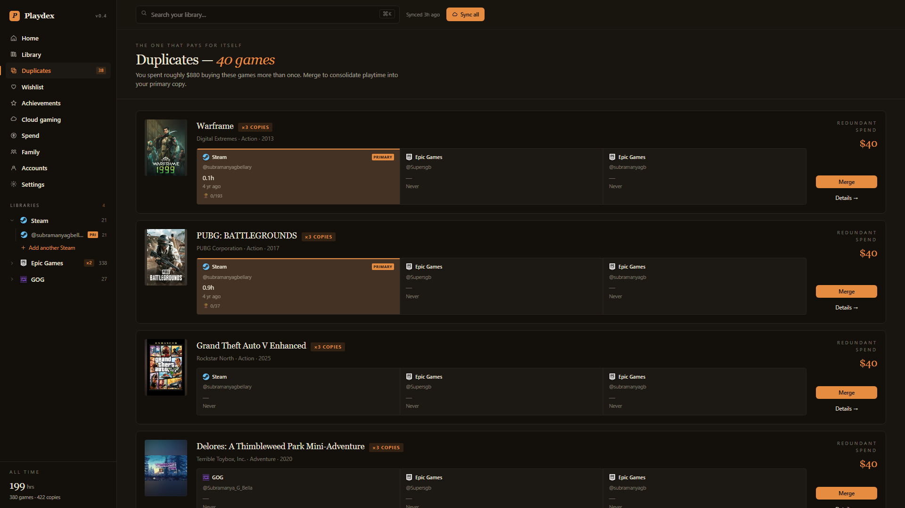
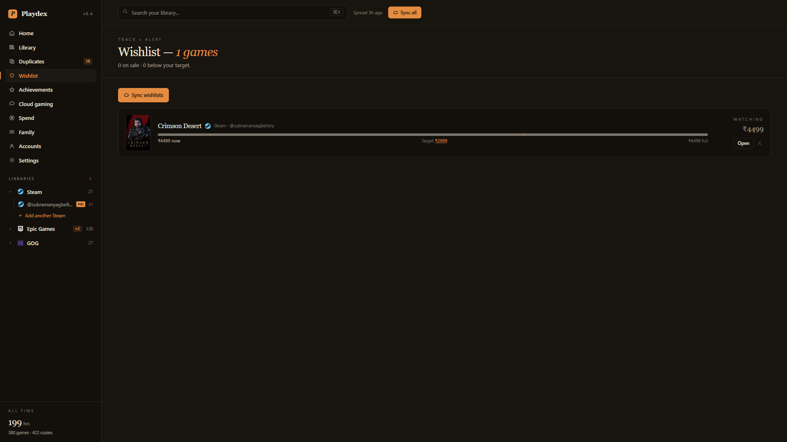
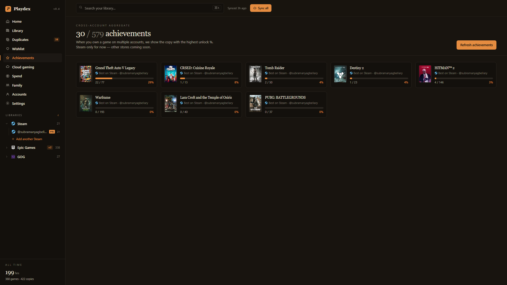
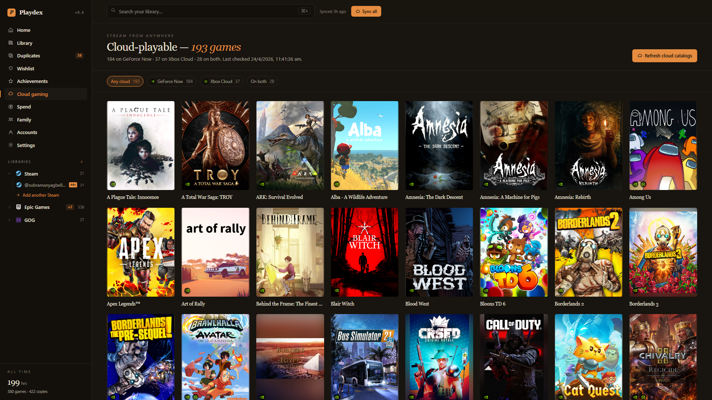
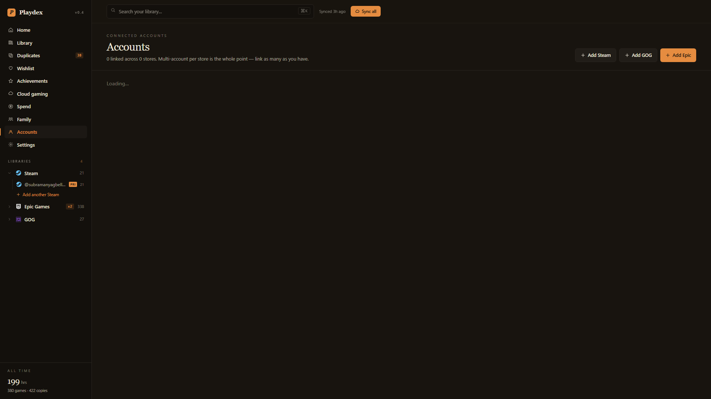

<div align="center">

# Playdex

### One library for every store. Steam, Epic, GOG, Stove, Play — unified.

A self-hosted game library manager for gamers who buy games on multiple stores
*and* multiple accounts per store. Connects your shelves, flags duplicates, and
tells you how much you spent buying the same game twice.

[](https://www.gnu.org/licenses/agpl-3.0)
[](https://nextjs.org/)
[](https://react.dev/)
[](https://www.prisma.io/)
[](https://www.typescriptlang.org/)
[](./CONTRIBUTING.md)
[](./CODE_OF_CONDUCT.md)



</div>

---

## Why Playdex

Most library managers assume one account per store. Reality says otherwise —
an old Steam account from college. A Family-Sharing alt. A GOG login from the
Witcher-bundle days. An Epic account that exists only because of free games.

Playdex stitches them all together and surfaces the part nobody else does: how
often you bought the **same game twice** across stores and accounts.

## Features

| Category | Feature | Status |
|---|---|---|
| **Connectors** | Steam — owned games, dev/genre/year, per-game achievements | ✅ |
|  | GOG — OAuth, library, v2 metadata | ✅ |
|  | Epic Games — EGL OAuth, library, Store GraphQL | ✅ |
|  | Stove, Google Play | ⏳ Stub |
| **Library** | Multi-account per store (link as many as you want) | ✅ |
|  | Cross-store duplicate detection (normalized title match) | ✅ |
|  | Soft-merge — pin primary copy, hide secondaries | ✅ |
|  | Manual canonical-game merge when auto-dedupe misses | ✅ |
|  | Grid + list, filters (store, account, played, genre, favorites, hidden, backlog) | ✅ |
|  | Sort: title / recently played / most played / most copies | ✅ |
| **Cloud** | GeForce Now + Xbox Cloud catalog cross-reference | ✅ |
| **Meta** | Achievements aggregation — best-% copy per game | ✅ |
|  | Procedural cover art with real-cover fallback | ✅ |
|  | Image proxy + on-disk cache (`.next/img-cache/`) | ✅ |
|  | Background auto-sync (configurable interval) | ✅ |
|  | AES-GCM encrypted credentials at rest | ✅ |
| **UX** | 4-step onboarding flow with "second account" hero moment | ✅ |
| **Roadmap** | Wishlist price tracking, Family sharing view, Spend dashboard | ⏳ In progress |

## Screenshots

<table>
<tr>
<td width="50%"><br/><sub><b>Home</b> — cross-store overview + redundant-spend hero</sub></td>
<td width="50%"><br/><sub><b>Library</b> — unified grid across every connected account</sub></td>
</tr>
<tr>
<td width="50%"><br/><sub><b>Duplicates</b> — games bought more than once</sub></td>
<td width="50%"><br/><sub><b>Wishlist</b> — target-price tracking</sub></td>
</tr>
<tr>
<td width="50%"><br/><sub><b>Achievements</b> — best-% copy per game, cross-account</sub></td>
<td width="50%"><br/><sub><b>Cloud gaming</b> — GeForce Now + Xbox Cloud matches</sub></td>
</tr>
<tr>
<td colspan="2"><br/><sub><b>Accounts</b> — multi-account per store, one list</sub></td>
</tr>
</table>

## Tech

- **Next.js 16** App Router (Turbopack)
- **React 19**
- **Prisma 7** with split-client + `better-sqlite3` adapter
- **Tailwind 4** + custom design tokens (warm-dark editorial palette)
- **TypeScript** end-to-end
- **Zod** for input validation

No external services. Runs entirely on your machine.

## Getting started

**Prerequisites:** Node 20+, npm 10+.

```bash
git clone https://github.com/SubramanyaGB/playdex.git
cd playdex
npm install

cp .env.example .env
# Edit .env — at minimum CREDS_KEY (32-byte base64) + STEAM_API_KEY

npx prisma migrate deploy
npx tsx prisma/seed.ts

npm run dev
```

Open http://localhost:3000.

### .env keys

```env
DATABASE_URL="file:./prisma/dev.db"

# 32-byte base64
# node -e "console.log(require('crypto').randomBytes(32).toString('base64'))"
CREDS_KEY=""

# https://steamcommunity.com/dev/apikey
STEAM_API_KEY=""

# Background auto-sync threshold in hours (0 = disabled)
AUTOSYNC_HOURS="6"

# Wishlist + price region override (ISO country / currency code)
STORE_REGION="IN"
STORE_CURRENCY="INR"

# GeForce Now region (IN / US / GB / EU / DE / JP)
GFN_REGION="IN"
```

## Connecting accounts

| Store | Auth | Notes |
|-------|------|-------|
| Steam | Public profile + dev API key | Profile must have **Game details: Public** |
| GOG   | OAuth via GOG Galaxy client  | Login → paste redirect URL |
| Epic  | OAuth via EGL client         | Login → paste authorization JSON |

Tokens encrypted with `CREDS_KEY` (AES-256-GCM) before storage. Rotating the
key requires re-encrypting all `Account.credsEnc` rows.

## Maintenance endpoints

```bash
# Re-pull rich metadata + achievements for played games
curl -X POST http://localhost:3000/api/backfill

# Include unplayed Steam games in achievements backfill
curl -X POST 'http://localhost:3000/api/backfill?onlyAch=1&includeUnplayed=1'

# Drop orphan Game / GameOnStore rows
curl -X POST http://localhost:3000/api/cleanup
```

## Architecture

```
app/
  page.tsx              Home dashboard
  library/              Library grid/list + detail + merge modals
  duplicates/           Duplicates hero view
  accounts/             Linked accounts manager
  achievements/         Cross-account achievements
  wishlist/             Wishlist + price tracking
  cloud/                GeForce Now + Xbox Cloud matches
  onboarding/           4-step intro flow
  settings/             Toggles + replay-onboarding
  api/                  REST endpoints (accounts, sync, games, backfill, cleanup, img)

lib/
  db.ts                 Prisma client singleton (better-sqlite3 adapter)
  crypto.ts             AES-GCM encrypt/decrypt for creds
  sync.ts               Per-store sync orchestration + dedupe
  wishlist-sync.ts      Wishlist + price sync
  store-meta.ts         Brand palette per store
  connectors/
    steam.ts            ResolveVanityURL, GetOwnedGames, appdetails, achievements
    gog.ts              OAuth, refresh, library, v2 enrichment
    epic.ts             OAuth, refresh, library, Store GraphQL
  cloud/
    geforce-now.ts      NVIDIA public catalog
    xbox-cloud.ts       Microsoft displaycatalog SIGL
  design/               Primitives, sidebar, chrome, derived queries

prisma/
  schema.prisma         Account, Game, GameOnStore, OwnedCopy, WishlistItem, Tag
  seed.ts               Stores table seed
```

## Data model

```
Store          steam | epic | gog | stove | play
Account        many per Store. Encrypted creds + label/handle/avatar.
Game           canonical title (dedup by normalized title).
               + dev / genre / releaseYear / tagsJson / cover
               + isFavorite / isHidden / mergedPrimaryAccountId
GameOnStore    Game × Store. storeGameId (Steam appid, GOG productId, ...).
OwnedCopy      Account × GameOnStore. Playtime, lastPlayed, achievements N/M.
WishlistItem   Account × storeGameId. Price tracking + targetPriceCents.
Tag / GameTag  User-defined labels, many-to-many.
```

## Roadmap

- [ ] Stove + Google Play connectors
- [ ] Wishlist price-drop alerts
- [ ] Family sharing view across Steam accounts
- [ ] Spend dashboard (currency-normalized)
- [ ] Cloud-save health check
- [ ] Docker image + Fly.io one-click deploy
- [ ] PostgreSQL adapter option (for self-hosters)

## Status

Personal build, **not production**. Single-user assumption — no auth on the
app itself. Run locally or behind a private tunnel only.

## Contributing

Contributions welcome. See [CONTRIBUTING.md](./CONTRIBUTING.md) for dev setup
and conventions. Please read the [Code of Conduct](./CODE_OF_CONDUCT.md)
before posting.

## Security

Found a vulnerability? See [SECURITY.md](./SECURITY.md) — do not open a public
issue.

## License

[AGPL-3.0](./LICENSE) © 2026 Subramanya Gopal Bellary.

Any network-accessible modified deployment must publish source under the same
license. OAuth client secrets embedded in the GOG / Epic connectors are the
public Galaxy / Launcher client IDs intended for desktop clients — do **not**
host Playdex as a multi-tenant service without rotating them.

## Acknowledgments

- Steam Web API, GOG Galaxy OAuth, Epic Games Launcher OAuth
- NVIDIA GeForce Now catalog, Xbox Cloud `displaycatalog` SIGL
- Cover art: store CDNs (Steam, Epic) with procedural fallback
